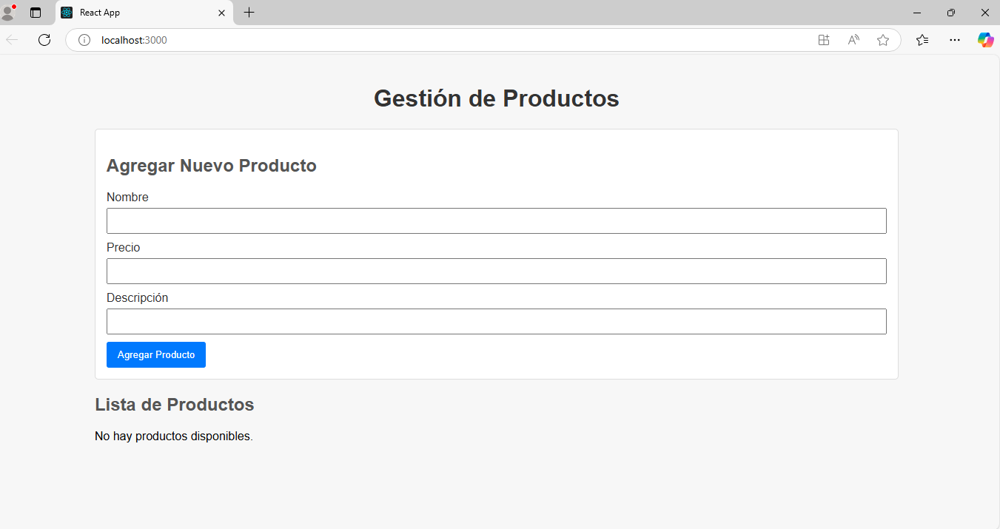
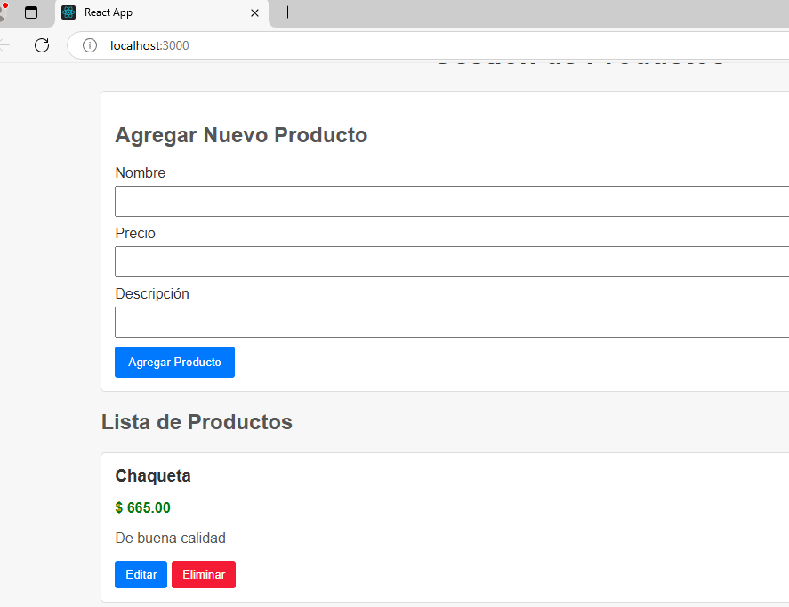
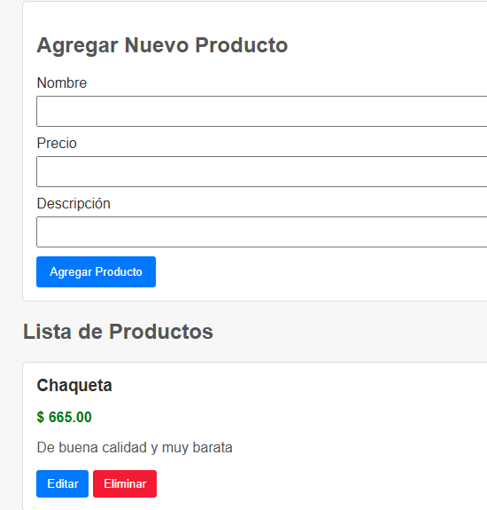
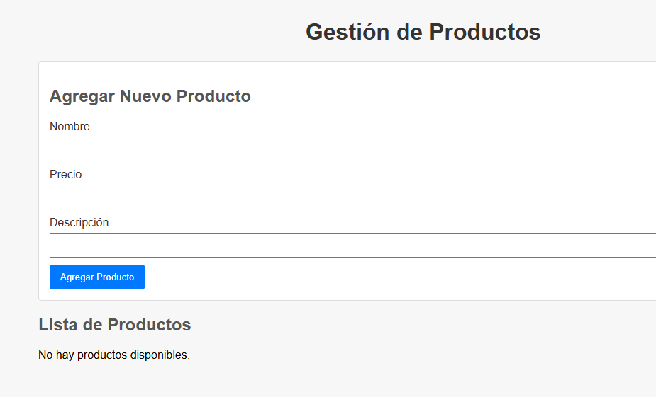

# Product Management CRUD Application


A simple and efficient product management application built with React. This project implements a complete CRUD (Create, Read, Update, Delete) system for managing products through a clean and intuitive user interface.

## Table of Contents 📋

- Features
- Technologies Used
- Node.js and Modules
- Architecture
- Integration with Backend
- Project Setup
- Project Structure
- Usage
- Contributions

## Features

- View a list of all products
- Add new products with name, price, and description
- Edit existing product information
- Delete products from the database
- Responsive UI built with styled-components

## Technologies Used 🛠️

- **React**: Main library for building the user interface
- **styled-components**: CSS-in-JS library for component styling
- **Axios**: HTTP client for making API requests
- **Create React App**: React application scaffolding

## Node.js and Modules 📦

The application is built on Node.js, which is required to run any React project. Below are the main npm modules used and their purpose in the application:

### Main Modules

```json
{
  "dependencies": {
    "@testing-library/dom": "^10.4.0",
    "@testing-library/jest-dom": "^6.6.3",
    "@testing-library/react": "^16.2.0",
    "@testing-library/user-event": "^13.5.0",
    "axios": "^1.8.4",          // HTTP client for API communication
    "react": "^19.0.0",         // Core React library
    "react-dom": "^19.0.0",     // React DOM rendering
    "react-scripts": "5.0.1",   // React build scripts and configuration
    "styled-components": "^6.1.16", // CSS-in-JS styling
    "web-vitals": "^2.1.4"      // Web performance metrics
  }
}
```

### Installing Modules

To install all necessary dependencies, run the following command in the project root:

```bash
npm install
```

## Architecture 🏗️

The frontend follows a modern React architecture with clear separation of concerns:

### Component Structure

The application is organized following a component pattern with these layers:

- **UI Components**: Reusable interface elements styled with styled-components
- **Container Components**: Components with business logic and state management
- **Services**: Logic for API communication via Axios

### Component Pattern

```jsx
// Example of a reusable styled component
const Button = styled.button`
  background: ${(props) => props.bg || "#0077ff"};
  color: #fff;
  border: none;
  padding: 8px 12px;
  margin-right: 5px;
  border-radius: 3px;
  cursor: pointer;

  &:hover {
    background: ${(props) => props.hover || "#005fcc"};
  }
`;
```

### Container/Presentational Pattern

Clear separation between presentation components (pure UI) and containers (with business logic):

```jsx
// ProductItem component handling both display and logic
function ProductItem({ product, onDelete, onUpdate }) {
  const [isEditing, setIsEditing] = useState(false);
  const [editedName, setEditedName] = useState(product.nombre);
  const [editedPrice, setEditedPrice] = useState(product.precio);
  const [editedDescription, setEditedDescription] = useState(product.descripcion);

  // Business logic for handling product updates
  const handleUpdate = (e) => {
    e.preventDefault();
    
    axios
      .patch(`${API_URL}/${product.idProducto}`, {
        nombre: editedName,
        precio: editedPrice,
        descripcion: editedDescription,
      })
      .then(() => {
        setIsEditing(false);
        onUpdate();
      })
      .catch((error) => {
        console.error("Error updating product:", error);
      });
  };

  // UI rendering logic with conditional rendering
  return (
    <Card>
      {isEditing ? (
        <form onSubmit={handleUpdate}>
          {/* Form inputs */}
        </form>
      ) : (
        <>
          {/* Product display */}
        </>
      )}
    </Card>
  );
}
```

## Integration with Backend 🔌

Communication with the backend is handled through Axios to perform HTTP requests to the REST API:

```javascript
// Example API call from ProductList.js
useEffect(() => {
  axios
    .get("http://localhost:8080/api/producto")
    .then((response) => {
      setProducts(response.data);
    })
    .catch((error) => {
      console.error("Error fetching products:", error);
    });
}, [refresh]);
```

### API Endpoints

The application connects to a RESTful API with the following endpoints:

- `GET /api/producto`: Retrieve all products
- `POST /api/producto`: Create a new product
- `PATCH /api/producto/{id}`: Update a product by ID
- `DELETE /api/producto/{id}`: Delete a product by ID

## Project Setup ⚙️

### Prerequisites

- Node.js 16.x or higher
- npm 8.x or higher

### Running the Project Locally

1. Clone the repository:

```bash
git clone https://github.com/AnderssonProgramming/crud_rt.git
```

2. Navigate to the project directory:

```bash
cd crud_rt
```

3. Install dependencies:

```bash
npm install
```

4. Start the application:

```bash
npm start
```

The application will be available at [http://localhost:3000](http://localhost:3000)

### Building for Production

To generate an optimized version for production:

```bash
npm run build
```

The output files will be in the `build/` folder.

## Project Structure 📁

```
src/
├── components/          # Reusable components
│   ├── ProductForm.js   # Component for adding new products
│   ├── ProductItem.js   # Component for displaying and editing a product
│   └── ProductList.js   # Component for listing all products
├── App.js               # Main application component
├── index.js             # Entry point
└── App.css              # Global styles
```

## Usage

### Main Interface

The application provides a simple interface with a form to add new products at the top, followed by a list of existing products below.

### Adding a Product

1. Fill in the product name, price, and description in the form
2. Click "Add Product" button




### Editing a Product

1. Click the "Edit" button on any product card
2. Modify the product information in the form that appears
3. Click "Save" to apply changes or "Cancel" to discard them



### Deleting a Product

1. Click the "Delete" button on any product card
2. The product will be immediately removed from the database



## Contributions 🤝

This project follows collaborative development practices:

1. Fork the project
2. Create a feature branch (`git checkout -b feature/amazing-feature`)
3. Commit your changes (`git commit -m 'Add some amazing feature'`)
4. Push to the branch (`git push origin feature/amazing-feature`)
5. Open a Pull Request

---

Built with React and ❤️
